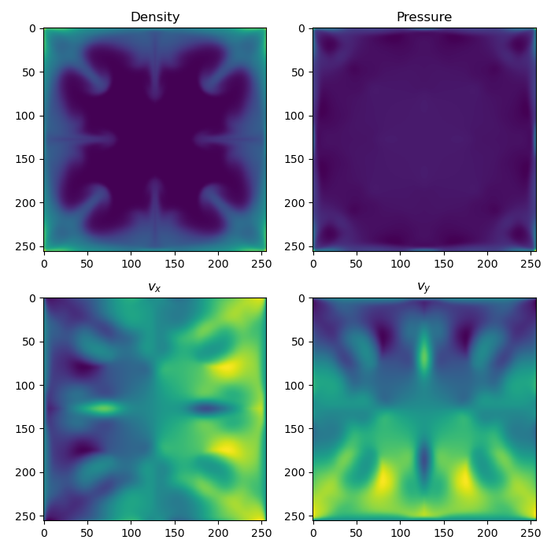

# FV2D


2D finite volume code with Kokkos for experimentation/prototyping purposes

Check the [change log](CHANGELOG.md) for the latest updates.

## Dependencies

* HDF5 (1.8+)
* A C++ compiler compatible with C++17
* CMake (3.16+)

## Cloning the repo

To clone FV2D, you need to clone the repository and the submodules. To do so from scratch:

```bash
git clone --recurse-submodules git@github.com:mdelorme/fv2d.git
```

If you have already cloned the repo but forgot to add the `--recurse-submodules`, you can still get the submodules by typing at the root of fv2d the following commands:

```bash
git submodule init
git submodule update
```

## Building

Building relies on CMake. As FV2D is built with Kokkos included as a submodule, all Kokkos option have to be passed here. For more information on how to indicate which architecture/compiler you wish to use with Kokkos, please refer to the [Kokkos documentation](https://kokkos.org/kokkos-core-wiki/ProgrammingGuide/Compiling.html). Here are a few examples of build commands for FV2D depending on the architecture :

### Configuring on CPU with Clang

```bash
mkdir build_cpu
cd build_cpu
CC=clang CXX=clang++ cmake -DKokkos_ENABLE_OPENMP=ON -DCMAKE_BUILD_TYPE=Release ..
```

### Configuring on an NVidia GPU with Clang

```bash
mkdir build_nvgpu
cd build_nvgpu
CC=clang CXX=clang++ cmake -DKokkos_ENABLE_CUDA=ON -DCMAKE_BUILD_TYPE=Release ..
```

**Note**: using `nvcc` and not `clang` for compiling with CUDA might lead to problems because of an incompatibility between nvcc and HighFive the hdf5 wrapper used in this project.

### Configuring on an AMD GPU with HIP

```bash
mkdir build_amdgpu
cd build_amdgpu
CC=hipcc CXX=hipcc cmake -DKokkos_ENABLE_HIP=ON -DCMAKE_BUILD_TYPE=Release ..
```

### Compiling
Once the program has been successfully configured, you can build the code :

```bash
make -j
```

At the end of the compilation, an executable `fv2d` should be created in the build folder.

## Usage

To use `fv2d` simply run the `fv2d` executable and provide a `.ini` file on the command line. For instance, if you are in a build folder located right below the root of `fv2d`, you can run a test by typing :

```bash
./fv2d ../settings/blast.ini
```

The code will start outputting information :

```
░░░░░░░░░░░░░░░░░░░░░░░░░░░░░░░░░░░░░░░░░░░░░░░
░        ░░   ░░░░░░░░░   ░░░░░░░░░░░░░░░░░   ░
▒   ▒▒▒▒▒▒▒▒   ▒▒▒▒▒▒▒   ▒▒▒   ▒  ▒▒▒▒▒▒▒▒▒   ▒
▒   ▒▒▒▒▒▒▒▒▒   ▒▒▒▒▒   ▒▒▒  ▒▒▒▒▒   ▒▒▒▒▒▒   ▒
▓       ▓▓▓▓▓▓   ▓▓▓   ▓▓▓▓▓▓▓▓▓   ▓▓▓▓   ▓   ▓
▓   ▓▓▓▓▓▓▓▓▓▓▓   ▓   ▓▓▓▓▓▓▓▓   ▓▓▓▓▓  ▓▓▓   ▓
▓   ▓▓▓▓▓▓▓▓▓▓▓▓     ▓▓▓▓▓▓▓   ▓▓▓▓▓▓▓  ▓▓▓   ▓
█   █████████████   ███████         ███   █   █
███████████████████████████████████████████████
Computing dts at (t=0) : dt_hyp=0.000521995; dt_TC=1e+06; dt_visc=1e+06
 - Saving at time 0
Computing dts at (t=0.000551063) : dt_hyp=0.000480941; dt_TC=1e+06; dt_visc=1e+06
Computing dts at (t=0.00106851) : dt_hyp=0.000459815; dt_TC=1e+06; dt_visc=1e+06
...
```

Each reporting line indicate the current time `t` and the timesteps associated with each physical process. `dt_hyp` is the hyperbolic time step associated with the hydro update, `dt_TC` the time step associated with thermal conduction, and finally `dt_visc` the viscous time step.

Once the execution is finished, the code displays a "goodbye" message :

```
    █     ▀██  ▀██         ▀██                              ▄█▄
   ███     ██   ██       ▄▄ ██    ▄▄▄   ▄▄ ▄▄▄     ▄▄▄▄     ███
  █  ██    ██   ██     ▄▀  ▀██  ▄█  ▀█▄  ██  ██  ▄█▄▄▄██    ▀█▀
 ▄▀▀▀▀█▄   ██   ██     █▄   ██  ██   ██  ██  ██  ██          █
▄█▄  ▄██▄ ▄██▄ ▄██▄    ▀█▄▄▀██▄  ▀█▄▄█▀ ▄██▄ ██▄  ▀█▄▄▄▀     ▄
                                                            ▀█▀
```

After that, a `run.h5` file has been generated and contains all the outputs

## Analysis

To analyse the data the simplest way is to use python with `h5py`.

The HDF5 file stores all snapshots at the root in keys having the form `ite_{iteration number}`. So for instance, to access iteration #5 : `ite_5`.

On top of each iteration, the root of the hef5 file stores the coordinates of the points of the mesh in the keys `x` and `y`.

Each iteration stores the primitive values associated with the run, so `rho`, `prs`, `u` and `v`.

For instance, to plot the status of the blast at the last step :

```python
import h5py
import numpy as np
import matplotlib.pyplot as plt

f = h5py.File('run.h5', 'r')

Nite = len(f.keys())-2 # removing x and y
ite = f[f'ite_{Nite-1}']

fig, ax = plt.subplots(2, 2, figsize=(7, 7))
ax[0,0].imshow(ite['rho'])
ax[0,1].imshow(ite['prs'])
ax[1,0].imshow(ite['u'])
ax[1,1].imshow(ite['v'])

ax[0,0].set_title('Density')
ax[0,1].set_title('Pressure')
ax[1,0].set_title('$v_x$')
ax[1,1].set_title('$v_y$')

plt.tight_layout()
plt.show()

f.close()
```




More example of post-treatment scripts can be found in the `python` folder at the root of FV2D.

## Contributors

* Maxime Delorme
* Grégoire Doebele
* Lucas Barbier
* Adam Finley
* Sixtine Marcotte
